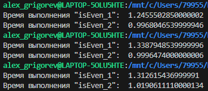
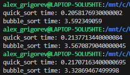

# Lesta-Games-Test-Task

### Вопрос №1: Реализации isEven.

#### isEven_1 (%)
**Преимущества:**
- Простая читаемость кода.

**Недостатки:**
- Проигрывает в скорости побитовому сравнению при больших числах.

#### isEven_2 (&)
**Преимущества:**
- Быстрая скорость выполнения. Побитовые операции выполняются быстрее, чем арифметические операции.

**Недостатки:**
- Не самая очевидная запись для восприятия.

`Наглядное представление скорости работы на больших числах. Количество итераций при каждом запуске = 10_000_000`

### Вопрос №2: Реализации FIFO (First-In-First-Out)

#### FIFO_static
**Преимущества:**
- Скорость вставки и удаления элементов O(1).
- Использование фиксированной памяти.

**Недостатки:**
- Ограниченный размер.
- При переполнении выбрасывает исключение.

#### FIFO_static_overwrite
**Преимущества:**
- Скорость вставки и удаления элементов O(1).
- Использование фиксированной памяти.
- Исключает переполнение очереди путем перезаписи старых элементов.

**Недостатки:**
- Потеря данных при перезаписи.

#### FIFO_dynamic
**Преимущества:**
- Скорость вставки и удаления элементов O(1).
- Эфективное использование памяти (увеличение размера в случае необходимости).

**Недостатки:**
- При увеличении размера буфера потребуется время для переноса данных из старого буфера в новый.

### Вопрос №3. Реализация Quick Sort

#### Аргументы в пользу соответствия данного алгоритма заданным критериям:

Быстрая сортировка в среднем случае имеет временную сложность O(n log n), в то время как пузырьковая сортировка,
приведенная для сравнения, имеет временную сложность O(n^2), где n - длина передаваемого на вход массива.
Такая временная сложность у быстрой сортировки обеспечивается следующими факторами:
- Рекурсивное выполнение данной функции.
- Разделение массива на 2 подмассива на каждой итерации рекурсии.
- Также данная функция не использует дополнительной памяти, кроме той, что изначально была отведена под массив.

`Для наглядного представления прикладываю результаты по скорости выполнения быстрой и пузырьковой сортировок.`
`Массивы, передаваемые на вход функциям - идентичны, количество элементов в массиве = 1000, количество измеряемых итераций = 100.`

